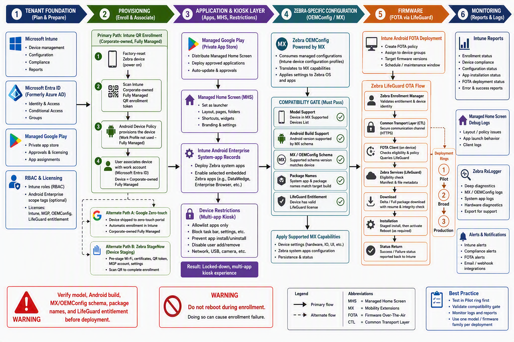

# Zebra Android Enterprise with Microsoft Intune

**Practical deployment guide:** Fully Managed, QR provisioning, Managed Home Screen, OEMConfig, and FOTA

**Audience:** Administrator
**Platform:** Android (Zebra Android Enterprise devices)
**Intune workload:** Devices / Apps / Tenant administration
**Last reviewed:** 2026-09-16
**Status:** Draft

---

## 1. Architecture and prerequisites

### Target management mode

Use Android Enterprise Corporate-owned Fully Managed (COBO) when each corporate device is associated with one user and used only for work. Intune can manage the whole device, restrict application sources, prevent removal of managed apps, and block user-initiated factory reset. The current Fully Managed enrollment requirement is Android 10 or later, with Google Mobile Services (GMS), connectivity to GMS, Android Enterprise support, and Play Protect certification.

**Important:** Managed Home Screen itself supports Android 8 or later, but that does not relax the current Android 10 minimum for new Intune Fully Managed enrollment.

### Tenant and administrative prerequisites

| Requirement | Implementation point |
|---|---|
| Intune foundation | MDM authority must be Microsoft Intune. A user or device benefiting from Intune requires an appropriate Intune license; Fully Managed is user-affiliated, so plan for a user license rather than the device-only licensing intended for dedicated/userless scenarios. |
| Managed Google Play | Connect the tenant under Devices > Enrollment > Android > Managed Google Play. The connecting account requires Intune Administrator or equivalent organization read/update permissions. Microsoft now recommends connecting with a Microsoft Entra account that has a mailbox. |
| Enrollment identity | The user must be licensed and permitted by enrollment restrictions. If Conditional Access applies “require compliant device” or block controls to all cloud apps, Android and browsers, exclude the Microsoft Intune cloud app from that enrollment-time policy because authentication uses a Chrome tab. |
| Zebra platform inventory | Record model, product configuration, Android version, Zebra build/LifeGuard level, MX version, GMS versus non-GMS image, storage, battery condition, and currently installed Zebra packages. Use Zebra’s MX Feature Matrix filtered by model, MX, Android/API and OSX version before creating OEMConfig settings. |
| Network | Permit Android Enterprise/Managed Google Play endpoints and the Zebra LifeGuard/Firebase endpoints needed for FOTA. Zebra documents HTTPS 443, Firebase Cloud Messaging ports 5228–5230, and Zebra download/enrollment hosts. |

### Compatibility boundaries

| Area | Key caveat |
|---|---|
| Android 11 | Either Zebra OEMConfig generation can apply, but the selected MX function must exist on the device. The newer schema can expose settings absent from older Android 11 MX builds, producing staging errors. |
| Android 12 | Microsoft’s current Zebra OEMConfig deployment article states that Zebra devices do not support Android 12. Do not create an Android 12 Zebra policy cohort without model-specific Zebra confirmation. |
| Android 13+ | Use Zebra OEMConfig Powered by MX, package com.zebra.oemconfig.release. Legacy OEMConfig is not compatible with Android 13 or later. |
| Android 10 and earlier | Use Legacy Zebra OEMConfig, package com.zebra.oemconfig.common; the Powered by MX application does not target Android 10 or earlier. |
| Mixed estate | Separate assignments by Android/MX cohort. Environments spanning versions older and newer than Android 11 require both Zebra OEMConfig applications. |
| Model-specific MX | Availability may vary by model, Android API, MX and OSX; Zebra’s matrix lets administrators filter to the exact device combination. |

## 2. QR-code provisioning — primary enrollment workflow

### A. Create the Fully Managed enrollment profile

- In Intune, go to Devices > Enrollment > Android > Android Enterprise > Enrollment Profiles > Corporate-owned, fully managed user devices and select Create policy.

- Select Corporate-owned, fully managed as the token type. Use via staging only when IT or a staging partner must preprovision the device before the user completes affiliation. Enrollment-time grouping is not supported with the staging token.

- Define a stable profile name and optional device-name template, using values such as serial number or username where useful. Do not casually rename deployed enrollment profiles; create a replacement profile when a naming change is required.

- Prefer enrollment-time grouping into a static pilot device group where available. Alternatively, use an assignment filter or a dynamic device group based on enrollmentProfileName; dynamic grouping cannot use the default enrollment profile.

- Open the profile’s Token page and display/export the QR code. Protect the QR/token because anyone possessing it can initiate the enrollment workflow; revoke and replace it if exposed.

### B. Prepare and enroll the Zebra device

- Confirm that the exact Zebra image is GMS-enabled and Android Enterprise capable, and that initial Wi-Fi can reach Google and Microsoft enrollment services. Factory-reset or wipe the device to its out-of-box state.

- On the first setup screen, tap repeatedly to launch the QR reader. Android 9 and later normally include the reader; scan the QR code shown in the Intune enrollment profile.

- Follow Setup Wizard prompts, connect to the network, allow Android Device Policy provisioning, and authenticate with the intended Microsoft Entra work account. Fully Managed enrollment automatically installs required Microsoft components including Microsoft Intune and Microsoft Authenticator.

- Do not restart the device until enrollment is complete. Microsoft warns that an interrupted Fully Managed enrollment can appear enrolled while failing to register correctly or receive policy protection.

- Validate in Intune that the device is corporate-owned, Fully Managed, user-affiliated, in the intended assignment group, recently checked in, and has received compliance/configuration policies. A manual Company Portal/Intune sync forces retrieval of current policies and applications.

### Secondary enrollment options

- Google zero-touch is appropriate for reseller-registered supported devices and high-volume out-of-box provisioning. It requires an authorized reseller and compatible hardware.

- Intune Fully Managed via staging supports IT or third-party preprovisioning before the user completes affiliation.

- Zebra StageNow can assist with local staging or prepare networking and Zebra-specific settings, but should not replace the designed Android Enterprise ownership flow. Token entry, NFC, and afw#setup are also supported fallback paths.

## 3. Managed Home Screen deployment

### Required configuration

- In Apps > All apps, confirm Managed Home Screen (com.microsoft.launcher.enterprise) is present from Managed Google Play and assign it as Required to the Fully Managed device group.

- Create an Android Enterprise Device restrictions profile. Under Device experience, select Kiosk mode (dedicated and fully managed) and Multi-app. Add only applications that are installed and required on the targeted devices.

- Configure the allow-listed apps/layout, lock the home screen, and restrict access to Android settings, status bar, navigation, factory reset, unknown sources, and other escape paths according to operational requirements. MHS controls the launcher experience but does not by itself block every Android system feature.

- For additional MHS settings, create Apps > Configuration > Managed devices > Android > Managed Home Screen. Configuration Designer covers common options; JSON is required for some arrays such as application lists, folders, advanced layout, widgets, and certain device-information options.

- Assign the MHS application, device restrictions, MHS app configuration, business apps, and Zebra system apps to the same device cohort. Every multi-app kiosk entry must be installed and assigned as Required; Microsoft warns that missing assignments can produce a wipe/contact-admin lockout message.

### MHS policy considerations

- Enable only needed controls such as Wi-Fi, Bluetooth, flashlight, volume, device information, virtual home button, or notification badges. Several require overlay, notification, write-settings, or exact-alarm permissions; Zebra OEMConfig can grant supported MHS permissions and reduce the need to expose Android Settings to users.

- Android 14+ requires exact-alarm permission for MHS screensaver, automatic sign-out, and automatic relaunch capabilities. Disable Notification windows only after testing, because overlay-dependent MHS features may stop working.

- Keep a controlled Leave kiosk mode PIN and document the support process. The MHS debug screen is available after approximately 15 Back-button presses and can open Android Device Policy, upload MHS logs, or temporarily pause kiosk mode.

## 4. Embedded Zebra applications and Android system apps

| Application | Purpose and recommended exposure | Verified package | Caveats |
|---|---|---|---|
| DataWedge | Zebra data-capture service/configuration UI. Expose to end users only if they must select or adjust approved scan profiles; otherwise enable it but omit it from MHS. | com.symbol.datawedge | Zebra documents Android Enterprise enrollment cases where DataWedge is disabled as a system app. The availability and UI vary by device/image. |
| RxLogger | Centralized system/application diagnostics and support log collection. Normally place in an admin/support folder, not the frontline landing page. | com.symbol.rxlogger | Zebra describes RxLogger as included with Zebra devices and documents package-based log paths; available modules vary by current RxLogger and platform version. |
| Device Central | Pair/unpair and inspect supported Bluetooth peripherals; useful when frontline workers legitimately manage scanners, printers or headsets. | com.symbol.devicecentral | Starting with Android 10 it is no longer built in and must be obtained from Zebra; model, peripheral and Mobility DNA licensing support varies. Therefore, deploy it as an application rather than assuming it is an embedded system app. |
| StageNow client | Local staging and selected administrative workflows. Generally enable only when required for a documented staging/FOTA dependency and keep it off the frontline MHS. | com.symbol.tool.stagenow | Intune FOTA requires this system app only on specific early Android 11 builds. |
| Zebra Device Manager | System component needed for Intune FOTA only on specific Android 11 builds. It is not normally a user-facing MHS application. | com.zebra.devicemanager | Required for builds 11-20-18.00-RG-U00 or ...U02; later Android 11 builds require neither this nor StageNow for that prerequisite. |

### Add an embedded app to Intune and MHS

- Go to Apps > All apps > Create > Android Enterprise system app.

- Enter a recognizable name, Zebra as publisher, and the verified package name.

- Assign the system app as Required to enable it; an Uninstall assignment disables it. System apps cannot be offered as Available.

- Add the same app to the MHS multi-app list/custom layout or MHS JSON allow-list. The package must be installed and assigned before MHS can display it.

- Validate after sync: system-app assignment succeeded, package exists, application launches, scanning/peripheral behavior works, and no unintended settings escape is possible.

## 5. Zebra OEMConfig through Intune

### Deployment workflow

- From Apps > All apps > Create > Managed Google Play app, select the correct Zebra OEMConfig application and synchronize it into Intune. Assign it as Required to the appropriate Android/MX device cohort.

- Select the correct application:

- Android 13+: Zebra OEMConfig Powered by MX (com.zebra.oemconfig.release).

- Android 11: select based on required MX functions and validated build.

- Android 10 or earlier: Legacy Zebra OEMConfig (com.zebra.oemconfig.common).

- Create Devices > Manage devices > Configuration > Create > Android Enterprise > OEMConfig and associate the synchronized Zebra app. Use Configuration Designer or reviewed JSON, then assign to device groups.

- Keep each profile below 500 KB. With Powered by MX, prefer one consolidated profile; if multiple profiles target the same device, do not configure the same top-level bundle in more than one profile because both can conflict. Profile delivery order is not guaranteed.

- Validate under the profile’s Monitor > Device status, then open the device’s configuration/app-configuration result for setting-level errors. Zebra OEMConfig executes the configuration and returns status to Intune.

### Relationship to MX

Representative documented areas include:

- UI and Settings-panel restrictions, notification/status-bar behavior.

- Wi-Fi, Bluetooth and peripheral controls.

- Key mapping and scanner-trigger behavior.

- Application/package permissions and battery-optimization exemptions.

- Device power, battery and charging controls.

- RxLogger configuration and collection.

- LifeGuard update mode and selected OTA behavior.

## 6. Firmware management — Intune FOTA as the primary method

### Prerequisites and onboarding

- Supported Intune enrollments are Zebra Android Enterprise Dedicated and Fully Managed devices. Microsoft requires Intune Plan 2 or another qualifying subscription, Android FOTA and Mobile apps RBAC permissions, Managed Google Play, and appropriate Zebra LifeGuard licenses/entitlements.

- Connect under Tenant administration > Connectors and tokens > Firmware over-the-air update > Zebra, consent to data sharing, authorize Intune in the Zebra portal, and retain the Zebra account identity for support.

- Deploy Zebra Enrollment Manager and Zebra Common Transport Layer as Required Managed Google Play apps. Create managed-device app configurations granting Phone state/read; configure Enrollment Manager with Claim Device and the connector enrollment token.

- For relevant Android 11 builds, enable the StageNow or Zebra Device Manager system package listed in the earlier table. Confirm all devices become enrolled and eligible in the Zebra LG OTA service before creating a deployment.

### Create and control a deployment

Important operational behavior:

- Deployments are immutable, “fire-and-forget” actions rather than persistent compliance policies. A failed device is not automatically retried after remediation.

- Eligible devices are snapshotted when the deployment is created. Devices later added to a dynamic group are not included; devices removed afterward may remain targeted. Only one deployment can include a device at a time, and assignment filters are unsupported.

- Android 10 and earlier can use delayed installation; on Android 11+, that delay setting has no effect because supported updates install in the background during download.

- Reports refresh approximately hourly and show eligible devices, firmware release, completion/failure counts, deployment ID, status detail and errors. NOTAPPLICABLE means the device is not LG OTA-enrolled or is ineligible for the selected update.

### Recommended rings

- Engineering validation: representative hardware variants, peripherals, barcode workflows and network conditions.

- Pilot: small operational cohort with support coverage; validate boot, enrollment retention, apps, scanning, OEMConfig, Wi-Fi/VPN and battery behavior.

- Broad ring: one site or business unit per compatible model/build family.

- Production: remaining compatible devices, still split by model and firmware path.

### Secondary Zebra firmware option

Where Intune FOTA is unavailable or unsuitable, Zebra documents File-Based Updates using a downloaded LifeGuard package, Zebra StageNow, OEMConfig/MX rules, or Recovery Mode. Zebra also exposes a Fully Automatic LifeGuard OTA mode outside the Intune-controlled EMM mode. File-based updating offers tighter local control or disconnected preparation but transfers package selection, hosting/download, sequencing and recovery responsibility to the administrator.

## 7. Recommended implementation sequence and validation

| Phase | Action and success criterion | Common failure |
|---|---|---|
| 1. Inventory | Build model/Android/LifeGuard/MX/GMS/package matrix; confirm FOTA and OEMConfig eligibility. | Assuming one package/schema supports every device. |
| 2. Tenant | Configure Intune authority, licensing, Managed Google Play, RBAC and CA enrollment exception. | Google connection or enrollment authentication blocked. |
| 3. Pilot groups | Create static enrollment-time and policy groups by compatibility cohort. | Dynamic group delay or mixed models. |
| 4. QR enrollment | Factory-reset, invoke QR reader, scan Fully Managed token, complete user affiliation without reboot. | Network, QR scaling, stale token or interrupted setup. |
| 5. Applications | Assign MHS, business apps, OEMConfig and selected Zebra system apps as Required. | Package not present on target image. |
| 6. MHS | Apply multi-app kiosk restrictions and allow-list/layout; verify no escape path. | MHS installed but kiosk policy absent or an app not Required. |
| 7. OEMConfig | Apply minimum viable settings and verify device/setting status. | Wrong schema, unsupported MX setting, duplicate parent bundle or >500 KB. |
| 8. FOTA onboarding | Connect Zebra, deploy Enrollment Manager/CTL and claim configuration; verify eligibility. | Entitlement, ports, missing Android 11 package or claim token. |
| 9. Pilot FOTA | Create model-specific scheduled deployment and collect before/after evidence. | Ineligible firmware path, insufficient battery/storage or device already in a deployment. |
| 10. Production | Progress through model/build rings with a rollback/recovery runbook. | Treating an immutable deployment like a persistent update policy. |

## 8. Concise troubleshooting matrix

| Symptom | Checks |
|---|---|
| QR reader/enrollment does not start | Confirm factory reset, repeatedly tap the first screen, test QR zoom/size, verify GMS/Play Protect, network reachability, token validity, Android 10+, and the CA exclusion. Do not reboot mid-enrollment. |
| MHS does not become active | Confirm MHS Required installation, Android Enterprise device-restrictions profile, Kiosk mode > Multi-app, matching device assignment and recent sync. |
| App missing from MHS | Confirm it is installed/enabled, assigned Required, present in the kiosk/MHS allow-list and using the exact package name. System apps cannot be assigned Available. |
| Embedded Zebra package is wrong | Check the exact target LifeGuard image; use Zebra documentation, RxLogger App Info/system-app inventory or OEM confirmation. Do not use another model’s package list as authoritative. |
| OEMConfig setting does not apply | Verify correct OEMConfig generation, app installation, Android/MX match, 500-KB limit, no top-parent conflicts and device-level OEMConfig error details. |
| MHS permission-dependent feature fails | Verify overlay/notification/write-settings/exact-alarm permission and ensure Notification windows policy is not blocking overlay-dependent functionality. |
| FOTA device is absent or NOTAPPLICABLE | Verify Fully Managed enrollment, Zebra LG OTA enrollment, entitlement, connector, Enrollment Manager/CTL, app configuration, Android 11 system-app prerequisite, model/firmware compatibility and network endpoints. |
| FOTA failed after condition corrected | Create a new deployment: LG OTA deployments do not automatically rerun after remediation. Record Intune deployment ID, Zebra deployment ID, model, serial, enrollment/update status and numeric error for escalation. |

## Evidence quality and reconciliation

The implementation above prioritizes Microsoft Learn pages updated in April–September 2026 and current Zebra TechDocs. The Intune Zebra FOTA documentation now presents the production workflow without a Preview navigation label, while older internal readiness material still references the 2023 public preview; the current public documentation should therefore govern implementation.

Microsoft documentation is authoritative for Intune portal behavior, licensing, assignments and reporting. Zebra documentation is authoritative for MX implementation, schema contents, package behavior, model compatibility and firmware paths. Where a setting appears in Intune but fails on-device, treat the Zebra MX/device matrix and actual LifeGuard build as decisive rather than assuming the console schema guarantees support.

---

## References

Documentation referenced by this guide.

### Microsoft Learn – Intune

- [Set up enrollment for Android Enterprise fully managed devices](https://learn.microsoft.com/en-us/intune/device-enrollment/android/setup-fully-managed)
- [Enroll Android Enterprise dedicated, fully managed, or corporate-owned work profile devices](https://learn.microsoft.com/en-us/intune/device-enrollment/android/ref-corporate-methods)
- [Enrollment guide: Enroll Android devices in Microsoft Intune](https://learn.microsoft.com/en-us/intune/device-enrollment/android/guide)
- [Connect your Intune account to your managed Google Play account](https://learn.microsoft.com/en-us/intune/device-enrollment/android/connect-managed-google-play)
- [Microsoft Intune licensing](https://learn.microsoft.com/en-us/intune/fundamentals/licensing)
- [Configure the Microsoft Managed Home Screen app](https://learn.microsoft.com/en-us/intune/app-management/configuration/configure-managed-home-screen)
- [Set permissions to Managed Home Screen using Android Enterprise](https://learn.microsoft.com/en-us/intune/device-configuration/templates/configure-managed-home-screen-permissions-android)
- [Android Enterprise device restriction settings](https://learn.microsoft.com/en-us/intune/device-configuration/templates/ref-device-restrictions-android-enterprise)
- [Manage Android Enterprise system apps](https://learn.microsoft.com/en-us/intune/app-management/configuration/manage-system-apps-android)
- [Add and assign managed Google Play apps to Android Enterprise devices](https://learn.microsoft.com/en-us/intune/app-management/deployment/add-managed-google-play)
- [Use OEMConfig on Android Enterprise devices in Microsoft Intune](https://learn.microsoft.com/en-us/intune/device-configuration/templates/configure-oemconfig-android)
- [Deploy OEMConfig profiles to Zebra devices using Microsoft Intune](https://learn.microsoft.com/en-us/intune/device-configuration/templates/deploy-oemconfig-zebra-android)
- [Zebra LifeGuard Over-the-Air integration with Microsoft Intune](https://learn.microsoft.com/en-us/intune/device-updates/android/setup-zebra-lifeguard)
- [Manage Android FOTA updates with Microsoft Intune](https://learn.microsoft.com/en-us/intune/device-updates/android/manage-fota)
- [Sync device in Company Portal for Android](https://learn.microsoft.com/en-us/intune/user-help/device-actions/sync-device-android)

### Zebra documentation

- [Full MX Feature Matrix](https://techdocs.zebra.com/mx/compatibility/)
- [Zebra Managed Configurations (OEMConfig)](https://techdocs.zebra.com/oemconfig/latest/mc2/)
- [OEMConfig Setup](https://techdocs.zebra.com/oemconfig/latest/setup/)
- [About Zebra LifeGuard for Android](https://techdocs.zebra.com/lifeguard/about/)
- [Device Update (LifeGuard)](https://techdocs.zebra.com/lifeguard/update/)
- [LifeGuard Over-the-Air Manager](https://techdocs.zebra.com/mx/fotamgr/)
- [Enterprise Home Screen (EHS) special features](https://techdocs.zebra.com/ehs/7-1/guide/features/)
- [About RxLogger](https://techdocs.zebra.com/rxlogger/5-4/guide/about/)
- [RxLogger user guide](https://techdocs.zebra.com/rxlogger/latest/guide/usage/)
- [About Device Central](https://techdocs.zebra.com/devicecentral/latest/guide/about/)
- [Enable DataWedge application in Android devices (Zebra Support)](https://support.zebra.com/article/Enable-DataWedge-Application-in-Android-Devices)
